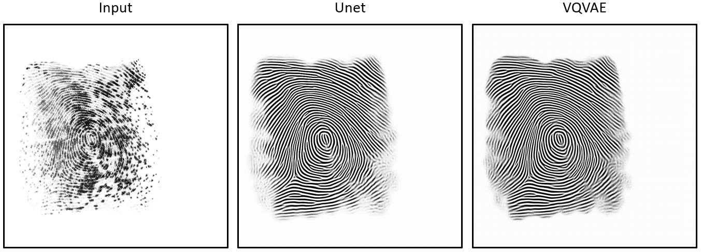

# FpEnhancer
This is a simple baseline for fingerprint enhancement.

## Introduction
This is a UNet structured network for fingerprint enhancement.
The basic block  comes from 
> Chen L, Chu X, Zhang X, et al. Simple baselines for image restoration[C]//European conference on computer vision. Cham: Springer Nature Switzerland, 2022: 17-33.
Input a fingerprint image, and the network will output the enhancement result in binary image format. Because a fully convolutional structure is used, there is no requirement for input size.

The overall flowchart of our proposed algorithm is shown as follows.
<br>
<p align="center">
     <br />
</p>
<br>

We use abour `800` high-quality rolled fingerprints and binary image extracted by VeriFinger as dataset. During training, `128x128` image patches are randomly sampled from the original complete image. The image patches are then added with some random noise as augmentation. The methods and examples of augmentation can refer to 
> Guan X, Pan Z, Feng J, et al. Joint Identity Verification and Pose Alignment for Partial Fingerprints[J]. arXiv preprint arXiv:2405.03959, 2024.

Examples of image augmentation are shown as follows.
<br>
<p align="center">
     <br />
</p>
<br>

## Run
* **train**
    ```shell
    python train.py
    ```
* **test**
    ```shell
    python inference.py
    ```
## Notice :exclamation:
Due to the fact that we only add some simple modal noise during training, there are still challenges in difficult scenarios such as latent fingerprints or complex backgrounds.
Below are two examples before and after fingerprint enhancement.

- example 1
<p align="center">
     <br />
</p>
<br>

- example 2
<p align="center">
     <br />
</p>
<br>


## License
This project is released under the MIT license. Please see the LICENSE file for more information.

## Contact me
If you have any questions about the code, please contact Xiongjun Guan gxj21@mails.tsinghua.edu.cn
