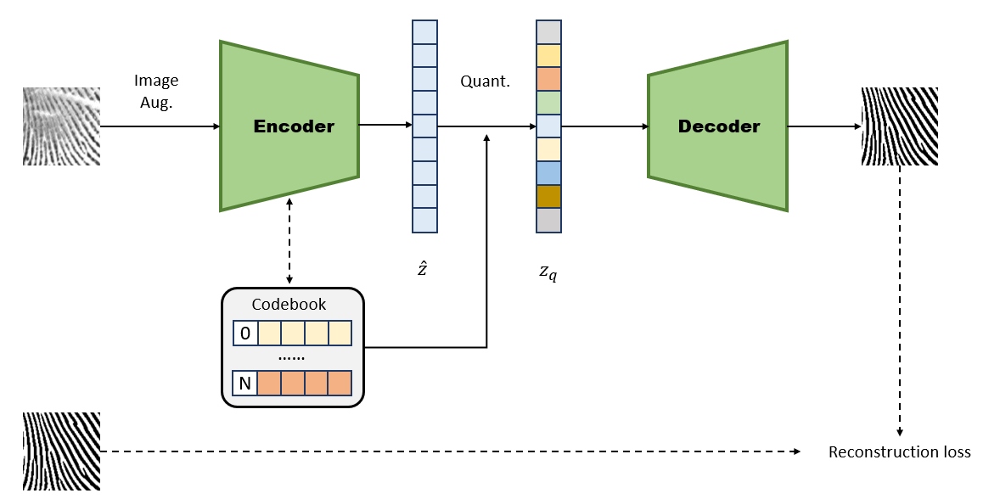

<!--
 * @Description: 
 * @Author: Xiongjun Guan
 * @Date: 2024-12-09 15:39:59
 * @version: 0.0.1
 * @LastEditors: Xiongjun Guan
 * @LastEditTime: 2025-01-02 10:59:52
 * 
 * Copyright (C) 2024 by Xiongjun Guan, Tsinghua University. All rights reserved.
-->
# FpEnhancer
This is a simple baseline for fingerprint enhancement.

## Introduction
This is a `UNet` structured network for fingerprint enhancement. Input a fingerprint image, and the network will output the enhancement result in binary image format. Because a fully convolutional structure is used, there is no requirement for input size.


The basic block  comes from 
> Chen L, Chu X, Zhang X, et al. Simple baselines for image restoration[C]//European conference on computer vision. Cham: Springer Nature Switzerland, 2022: 17-33.

The overall flowchart of our proposed algorithm is shown as follows.
<br>
<p align="center">
     <br />
</p>
<br>

We also explored the `VQVAE` form. Specifically, the codebook part is added between the original encoder and decoder, and the loss of quantization is additionally supervised.
The codebook block comes from
> Esser P, Rombach R, Ommer B. Taming transformers for high-resolution image synthesis[C]//Proceedings of the IEEE/CVF conference on computer vision and pattern recognition. 2021: 12873-12883.

The overall flowchart of our new algorithm is shown as follows.
<br>
<p align="center">
     <br />
</p>
<br>

In addition, we also tried the form of `CodeFormer`. On the basis of the original `VAVAE`, a transformer is added to select the serial number of codebook. We use `VQFormer` to refer to it in the following text.
> Zhou S, Chan K, Li C, et al. Towards robust blind face restoration with codebook lookup transformer[J]. Advances in Neural Information Processing Systems, 2022, 35: 30599-30611.

The overall flowchart of our new algorithm is shown as follows.
<br>
<p align="center">
     <br />
</p>
<br>


We use about `800` high-quality rolled fingerprints and binary image extracted by VeriFinger as dataset. During training, `128x128` image patches are randomly sampled from the original complete image. The image patches are then added with some random noise as augmentation. The methods and examples of augmentation can refer to 
> Guan X, Pan Z, Feng J, et al. Joint Identity Verification and Pose Alignment for Partial Fingerprints[J]. arXiv preprint arXiv:2405.03959, 2024.

Examples of image augmentation are shown as follows.
<br>
<p align="center">
     <br />
</p>
<br>

## Run
* **train Unet**
    ```shell
    python train_enhancer.py
    ```
* **train VQVAE**
    ```shell
    python train_VQenhancer.py
    ```

* **train VQFormer**
    ```shell
    python train_VQFormerEnhancer.py
    ```

* **test Unet**
    ```shell
    python inference_enhancer.py
    ```
* **test VQVAE**
    ```shell
    python inference_VQenhancer.py
    ```
* **test VQFormer**
    ```shell
    python test_VQFormerEnhancer.py
    ```

## Notice :exclamation:
Due to the fact that we only add some simple modal noise during training, there are still challenges in difficult scenarios such as latent fingerprints, highly blurry/incomplete images or complex backgrounds.
Below are examples before and after fingerprint enhancement.

- example 1
<p align="center">
     <br />
</p>
<br>

- example 2
<p align="center">
     <br />
</p>
<br>

- example 3
<p align="center">
     <br />
</p>
<br>

- example 4
<p align="center">
     <br />
</p>
<br>

- example 5
<p align="center">
     <br />
</p>
<br>

- example 6
<p align="center">
     <br />
</p>
<br>

- example 7
<p align="center">
     <br />
</p>
<br>

## Citation
If you find this repository useful, please give us stars and use the following BibTeX entry for citation.
```
@ARTICLE{guan2024joint,
  author={Guan, Xiongjun and Pan, Zhiyu and Feng, Jianjiang and Zhou, Jie},
  journal={IEEE Transactions on Information Forensics and Security}, 
  title={Joint Identity Verification and Pose Alignment for Partial Fingerprints}, 
  year={2025},
  volume={20},
  number={},
  pages={249-263},
  keywords={Fingerprint recognition;Feature extraction;Pose estimation;Correlation;Fingers;Authentication;Transformers;Skin;Sensors;Prediction algorithms;Fingerprint recognition;partial fingerprint;fingerprint verification;fingerprint pose estimation;transformer},
  doi={10.1109/TIFS.2024.3516566}}
```

## License
This project is released under the MIT license. Please see the LICENSE file for more information.

## Contact me
If you have any questions about the code, please contact Xiongjun Guan gxj21@mails.tsinghua.edu.cn
